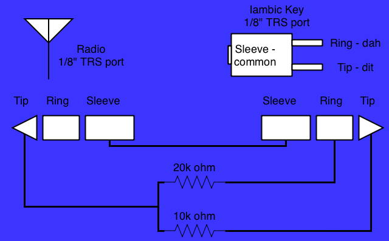

# CEC Paddle Cable (UV-K5 v1 Original Only)

The CEC cable is an alternative way to connect a paddle to the **original UV-K5** without opening up the radio or performing the [paddle rework](rework-overview.md). Instead, it plugs into the radio's existing 1/8" (3.5mm) headset jack and uses a pair of resistors to let the firmware tell the dit and dah contacts apart on a single audio line.

This only applies to the UV-K5 v1 original. The UV-K5 v3 and UV-K1 have a dedicated digital paddle signal on their USB-C port and don't support (or need) this trick — see [identify your radio](identify-your-radio.md) if you're not sure which one you have.

## How it works

A normal iambic paddle has three contacts: a common (ground), a dit contact, and a dah contact. The UV-K5's headset jack only exposes one spare signal line (the same line used for CEC/mic-style accessories on the stock radio), so there's no way to wire two independent switch closures to two independent pins like the rework does internally.

The CEC cable works around this by turning each paddle contact into a different resistance to ground on that one shared line, instead of a direct short:

- Closing the **dah** contact connects a 20k&#8201;Ω resistor between the line and ground.
- Closing the **dit** contact connects a 10k&#8201;Ω resistor between the line and ground.

The firmware reads this line with the ADC and distinguishes "no contact," "dit," and "dah" by voltage level rather than a simple open/closed digital read. Because resistor tolerances and the radio's own ADC vary a bit from unit to unit and cable to cable, you need to calibrate the two thresholds once per cable — see [CEC Cable Calibration](../menus-and-settings.md#cec-cable-calibration-uv-k5-v1-only) (`CWcrd`, `CWcLo`, `CWcHi`) on the menus and settings page.

## Menu setup

Once the cable is plugged in and calibrated, select one of the CEC options under [`CWkin`](../menus-and-settings.md#cw-key-input-cwkin):

| Setting | Description |
|---|---|
| CEC Cable | Iambic keyer active, dit/dah as wired. |
| CEC Cable Reversed | Same as above with dit/dah swapped. |
| CEC Cable Handkey | Treated as a straight key — no iambic keyer. |

!!! note
    PTT can't be used at the same time as a CEC Cable input mode, since they share a same wire. Use the CEC-connected paddle for CW keying only, and don't forget to unplug the cable when using voice modes like FM.

## Building the cable

The cable has a 1/8" (3.5mm) TRS plug on each end — one goes into the radio's headset jack, the other accepts your paddle's TRS plug (most iambic paddles already terminate in a 3.5mm TRS plug wired Tip=dit, Ring=dah, Sleeve=common).

To build it:

1. Tie the **Sleeve** of the radio-side plug and the **Sleeve** of the paddle-side plug together. This is the shared ground/common return.
2. From the radio-side **Tip**, run two resistors in parallel branches:
    - A 20k&#8201;Ω resistor.
    - A 10k&#8201;Ω resistor.
3. Connect the far end of the **20k&#8201;Ω** resistor to the paddle-side **Ring** (dah contact).
4. Connect the far end of the **10k&#8201;Ω** resistor to the paddle-side **Tip** (dit contact).

The radio-side **Ring** is not used and can be left unconnected.

When a paddle contact closes, it shorts its corresponding resistor's far end to the common sleeve, pulling the radio-side tip to a voltage set by that resistor. This is why the two CEC calibration thresholds (`CWcLo` for the 20k contact, `CWcHi` for the 10k contact) exist — the firmware reads the resulting voltage to figure out which contact (if any, one, or both) is closed.

## Calibrating

Your cable is likely to work "out of the box" after building, but if it's not reliably keying or you think your resistors are a little off-tolerance, you can use the calibration settings to let the firmware target the values of your copy of the cable.

1. Plug in your CEC cable with an iambic paddle connected.
2. Power on the radio while holding the PTT and upper side button ("side 1")
3. Upon boot, the radio should say "Release all keys" - after releasing the buttons, it should boot directly into the menu. The radio is now in "tech mode" or "hidden menu" mode, with extra settings in the menu.
4. Move to menu item 75, `CWCrd` - "ADC Read Check" and enter this item.
5. The screen will show `CWCrd` and a number. This is the ADC value reading from your cable. Hold each key of the CW paddle for 10 seconds each, and note the value - it should stabilize at a low number for one of the paddles, and a higher number for the other. For example in my radio and cable, I get 213 and 396 for the two numbers; yours should be in that ballpark. Write these numbers down.
6. Exit the menu item and enter the next item down, `CWcLo`. Change the value to the lower of the two values you recorded.
6. Save the value (**M** button) and enter the next menu item down, `CWcHi`. Change the value to the higher of the two values you recorded.
7. Save the value and power cycle the radio, test in normal boot mode.

## Other things to know

- **No internal rework needed.** This is the main appeal of the CEC cable: you get paddle input on the original UV-K5 without opening the case or removing/adding any internal components.
- **Resistor tolerance matters, but not as much as you'd think.** Prefer 1% tolerance resistors if you can, but don't fret over it. Looser tolerances widen the gap between the dit and dah voltage levels you'll see, and may even cause the two readings to land close enough together to misread. However, you can calibrate to the values in your particular copy of the cable.
- **Calibrate if it's not working right.** Follow the [calibration instructions](#calibrating) if you're getting weird results, it may help.
- **"CW KEY STUCK" on boot.** Like the port-based input modes, the firmware checks for a stuck-closed key whenever a CEC input mode is active. After flashing, if you still have the programming cable plugged in while in CEC input mode, you may see this message — see the [CW paddle input FAQ](cw-paddle-input.md#when-is-cw-input-valid-what-does-the-message-cw-key-stuck-mean) for more detail.
- **Headset jack behavior.** Plugging in the CEC cable uses the same jack as the stock microphone/headset. Unplug it when you want to use the internal mic for a voice mode.

## Next

- [Menus and settings — CW Key Input and CEC calibration](../menus-and-settings.md#cw-key-input-cwkin)
- [Paddle rework overview](rework-overview.md)
