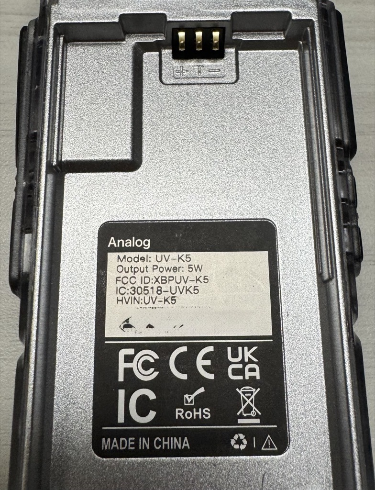
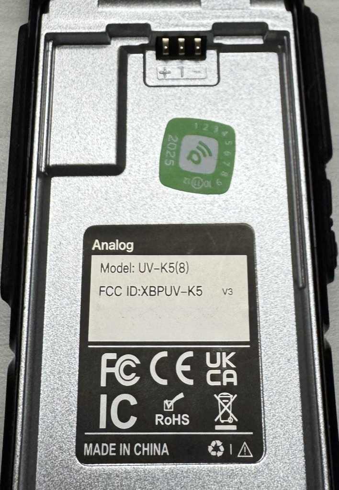
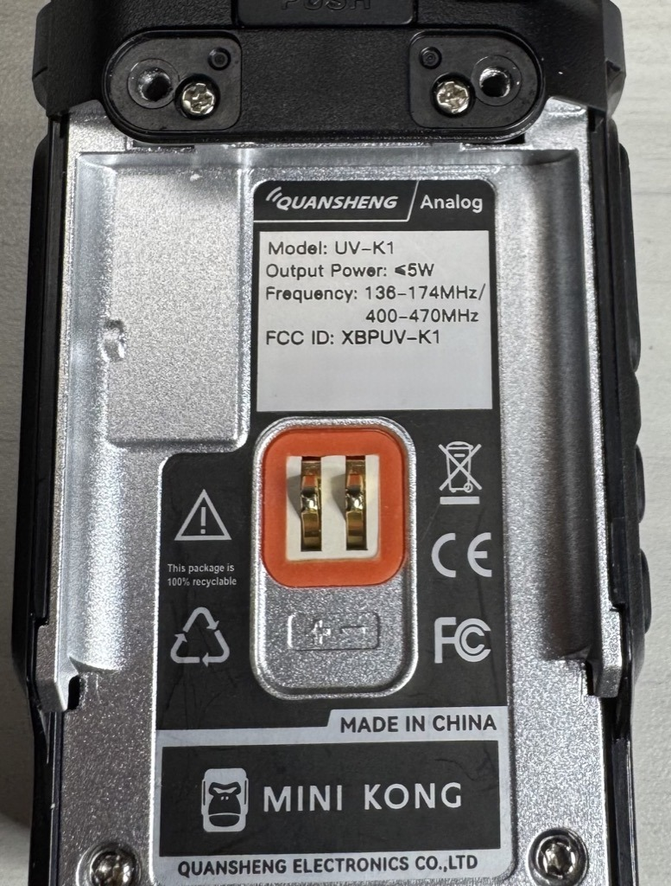

# Identify Your Radio

## Why the model matters

The firmware version (both the source code and the compiled binaries) are different between the UVK5 v1, and the UVK5v3/K1. The v3 and the K1 work with the same firmware. You must load the correct firmware for your radio model; loading the wrong one certainly won't run correctly and require a reflash; a few worst-case reports have required aggressive techniques to fix a bad flash and put the radio back in a working state.

The paddle rework is similar across the supported models, but the exact board layout, solder points, and illustrations differ.

The non-rework cable solutions are unique to each of the two families.

## UV-K5 v1 original

Also called the K5, K5(8), K5(99), and K6, they're all the same radio. Before buying: If the shop listing says "v2" or "v3" in it, then it's probably not an original v1; they usually advertise the newer ones pretty distinctly.

As of June 2026, all of the cases in non-black colors are v1. All orange, crystal clear case, the models with blue/red/yellow patches on the side. These are all v1.

### Behind the battery of the v1

Remove the battery and inspect the back label; this is the best indicator of model without tearing the radio apart. The distinguishing characteristic of the v1 models is what they lack; none will say "v3" on the label. Only the last batches will have a date sticker.

### Inside the v1

If you open the radio and inspect the PCB, all of the v1 radios are printed with a PCB version 1.x. Commonly spotted were 1.4, 1.6, and 1.8. All of these can load the original K5 (v1) firmware, and be reworked for the iambic paddle via the v1 rework instructions.

## UV-K5 v3

The outer chassis of the v3 looks identical to the v1, in black with a grey/gunmetal surround of the display. The only way to tell is if the shop listing specifically says "v3", or once you get it in-hand and inspect the label behind the battery.

### Behind the Battery of the v3

The label says "V3". It's that easy, mostly.

!!! Warning
    There exists a version of the radio where the label is marked as V3, but PCB is silkscreened as V1.8, and a different microcontroller is used instead of the original. It's also been seen with "V2" written in sharpie on the PCB. This is a **version 2** radio, and will not work with either of the firmwares posted here. The community believes there are not many of these models produced, but it is a possibility.

    Version 2 radios may have also been marked without the V3 at some time.

See [https://github.com/armel/uv-k1-k5v3-firmware-custom/discussions/54](https://github.com/armel/uv-k1-k5v3-firmware-custom/discussions/54)

### Inside the v3

The PCBs are marked as V2.x. I've seen 2.0 and 2.1 so far. Historically, these PCB minor revisions are pretty minor, just swapping out a couple parts and usually not moving much if anything around.

## UV-K1

It's a K1. You bought a K1. Both case models with and without the chin are the same internals.

## Next

- [Download and flash](../download-and-flash.md)
- [CW paddle input — cable or rework?](cw-paddle-input.md)
