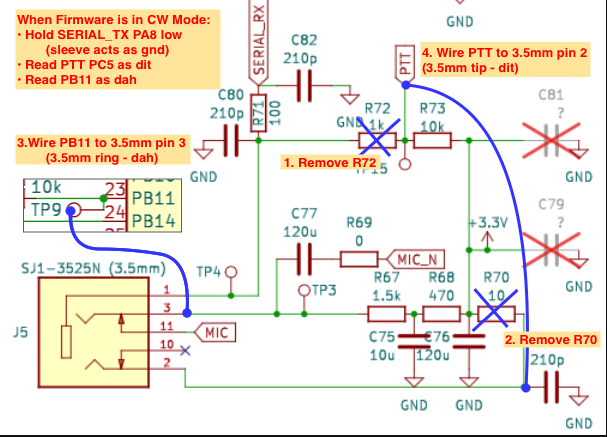

# Paddle Rework

This section documents the CW paddle rework for use with the CW firmware. If you haven't yet decided between the rework and a cable-based input, see [CW Paddle Input](cw-paddle-input.md) first.

## Why a rework?

The UVKx radios were not designed to accept a CW paddle directly into the 1/8" jack, but with some minor rework and firmware changes, they can accept the connection and read directly from the paddle key closures. It requires opening the radio (which is very easy to do with these models), and some light soldering.

The rework is technically reversible, although it requires removing two very small surface mount resistors that will vanish the moment you desolder them from the board.

For the rework, two resistors are removed from the board, and two new wires are added to connect points on the board. The positions of the resistors and wires are slightly different between the models, so the section below leads to the specific rework details for that model.

!!! warning
    Opening your radio and soldering stuff inside will void your warranty, duh.

## Tools and supplies

Although the two resistors are very small, most standard pencil-style soldering irons will be able to remove them successfully without doing damage to other nearby components. The soldering tip may be a conical point, chisel, or bevel, they can all get the job done. Adding a dab of solder to the end of the tip will help if it's very small.

Two wires are required for the rework, at lengths of about 50mm and 80mm. Nearly any small-gauge wire (about 22awg or smaller) will do; you do not need to go out and buy special rework wire. The rework has been performed simply by stripping out the internal wires from inside the USB cable shipped with the radio. Solid-core or stranded will work, but with stranded wire be careful of stray strands that might create unintended shorts at each soldered end of the wire.

## Choose your radio model

If you're not sure which radio model you have, follow the [radio identification guide](identify-your-radio.md)

=== "UV-K5 v1 original"
    This page covers the original UV-K5 hardware rework. All the v1 models like K6, K5(99) and others with V1.x PCBs inside follow this style.

    Go to [the v1 rework guide](rework-uv-k5-v1.md).

=== "UV-K5 v3"
    This page covers the UV-K5 v3 board layout and the updated resistor positions. It's really similar to the v1, things just moved around slightly.

    Go to [the v3 rework guide](rework-uv-k5-v3.md).

=== "UV-K1"
    This page covers the UV-K1-specific rework path. Things moved around a little more versus the v1, but it's still easy to perform.

    Go to [the UV-K1 rework guide](rework-uv-k1.md).

!!! warning "Mic behavior"
    The external mic/PTT path no longer works the same way after this rework. An external mic will not be able to trigger PTT. The internal mic still works when the paddle is unplugged, but once the paddle is plugged in the mic is switched out of the circuit, so unplug the paddle when using a voice mode.

## Rework Schematic

Each radio version has different reference designators for the resistors, but the fundamentals of this rework schematic are the same on all versions. Pin 23 / PB11 in the schematic below is the SWDIO pin. That is a different pin number on the K5v3/K1 microcontroller, but its use and the pad where the jumper wire is soldered to is the same.

Original schematic by MentalDetector:
https://github.com/mentalDetector/Quansheng_UV-K5_PCB_R51-V1.4_PCB_Reversing_Rev._0.9

### “Hey isn’t that the SWDIO line for SWD programming and debug?”
- Yes it is, and
this rework will prevent SWD from working (even in the bootloader) because there's too strong of a pullup on the line. If you need
to use SWD debugging, you’ll need to remove the wire from the SWDIO pad or
perform the older beta rework instead (see the bottom of this doc). If you have no idea what SWD is, don’t worry about this.

## Next

- [CW Paddle Input FAQs](cw-paddle-input.md#faqs)
