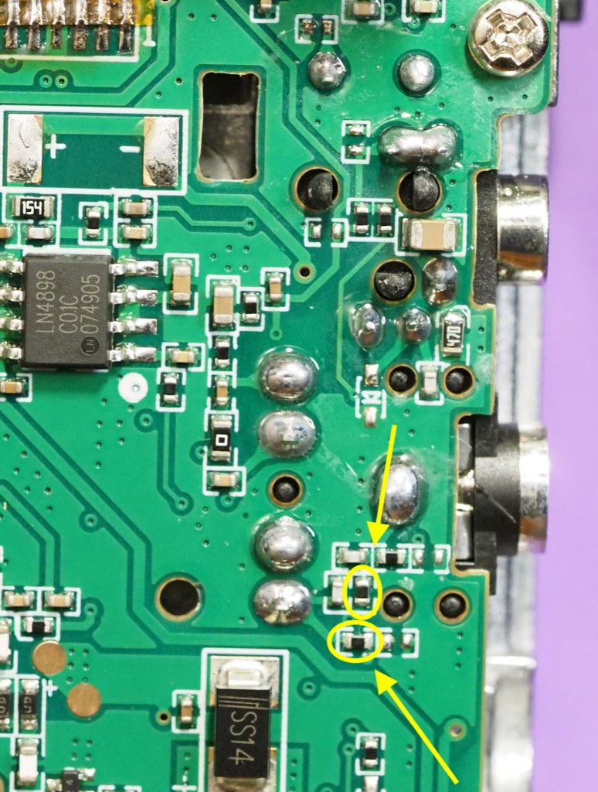
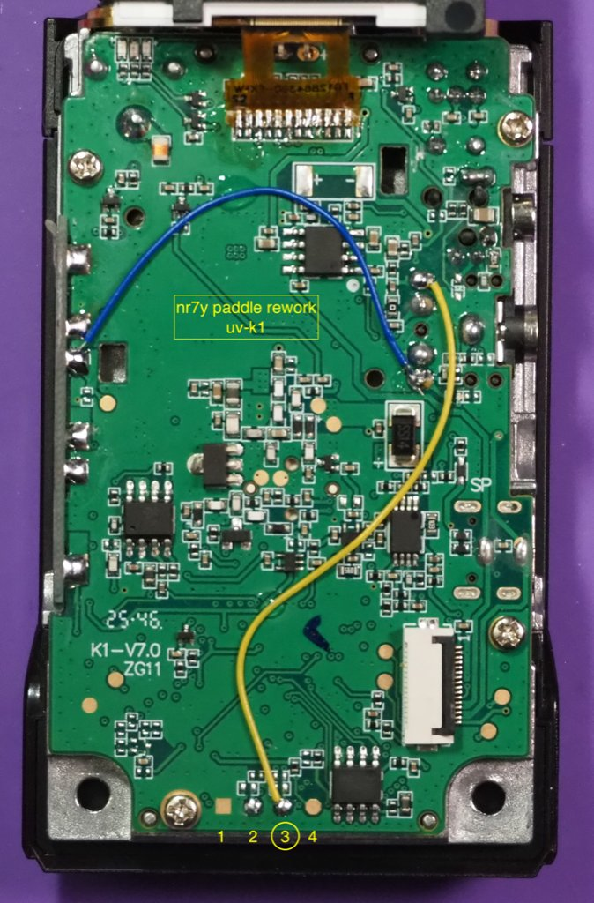

# Paddle Rework for UV-K1

This page covers the UV-K1-specific version of the CW paddle rework.

## Model notes

The UV-K1 follows the same overall idea as the UV-K5 rework, but the board layout is a little different.

## Before you begin

- Confirm you are working on a UV-K1, not a UV-K5 board.
- Review the shared notes in the [rework overview](rework-overview.md) first.
- Use the hardware identification page if you are unsure.

## Rework steps

1. Remove the battery, volume knob, and antenna.
2. Remove only the two screws behind the battery at the lower edge of the case. The screws on the front and the ones up by the battery release button do not matter.
3. Pry up at the lower edge of the case, between the plastic chassis and the inner metal back.
4. Once pried up enough, the metal inner portion will release from the plastic chassis and slide down. Slide it down only enough so that the volume knob stem clears the upper chassis, and be careful not to pull the metal inner too far away from the chassis yet.
5. In between the circuit board (which is attached to the metal backing) and the plastic chassis front half is a thin flex circuit; make sure not to over flex or torque this flex circuit as it can tear or damage the connecting socket on the circuit board.
6. Once the entire metal backing and circuit are free of the chassis, move it to the side or gently flip over to reveal the flex circuit socket on the circuit board. Opposite the side where the flex circuit enters the connector socket is a latching "door" that runs the length of the socket. Gently pry under this door (opposite side of the flex circuit entry) to cause the door to pivot and lift up. This will release the flex circuit from the socket, and it will slide out. Now the two halves are complete separated.
7. Release the display from the circuit board by pushing in at the lower left corner of the display housing frame, close to the circuit board. Use your fingers or a non-metallic device like a plastic spudger. This will release a catch which allows that corner of the display frame to lift away from the circuit; slightly wiggling the entire display frame once this corner is released will also release the catch in the top right corner, and the entire display may be gently lifted up and hinged over the top edge where a flex circuit connects the display to the circuit board.
8. With the display out of the way, remove the two resistors and install the two wires as noted.
9. After rework, gently reinstall the display with the top right edge latch first, then the lower left edge by dropping it back into the latch hole. Some inward pressure (similar to how it was released) helps the latch seat without having to push down directly on the display.
10. Note the display surface and clean if needed; this will be behind the chassis plastic cover later and you won't be able to clean any fingerprints or dust that arrived during the rework.
11. With the plastic chassis and circuit board near each other, and the flex circuit socket door in the lifted position, slide the flex circuit gold fingers into the socket. Latch the socket closed by hinging the door down.
12. Reinstall the metal back and circuit board into the plastic chassis by sliding in the top half, then pressing into the bottom section.
13. Reinstall the two screws.

## Post rework

With the rework complete, pick one of the Port modes from the CW key input menu and plug in a paddle. The input selection 'Handkey' will also work with a straight key in the port.
