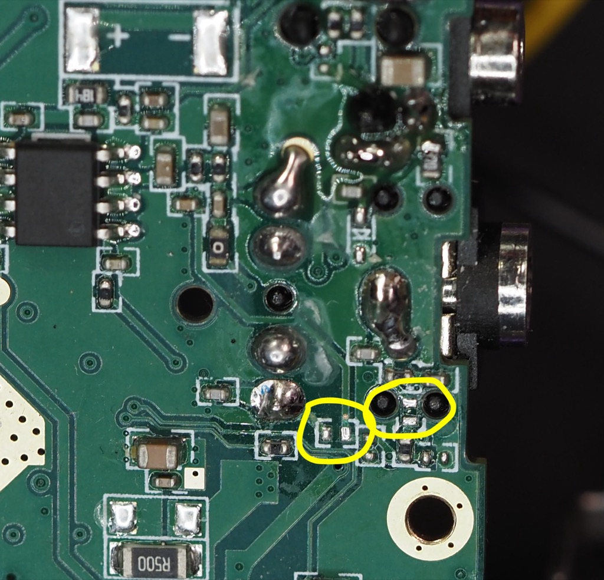
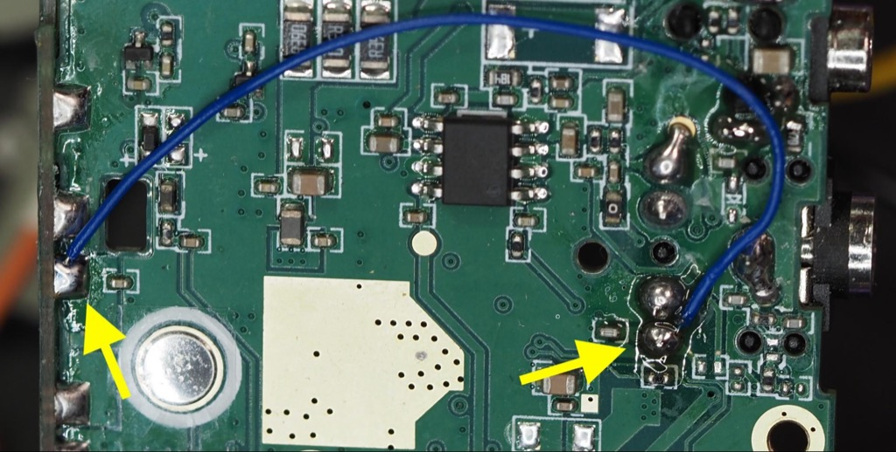
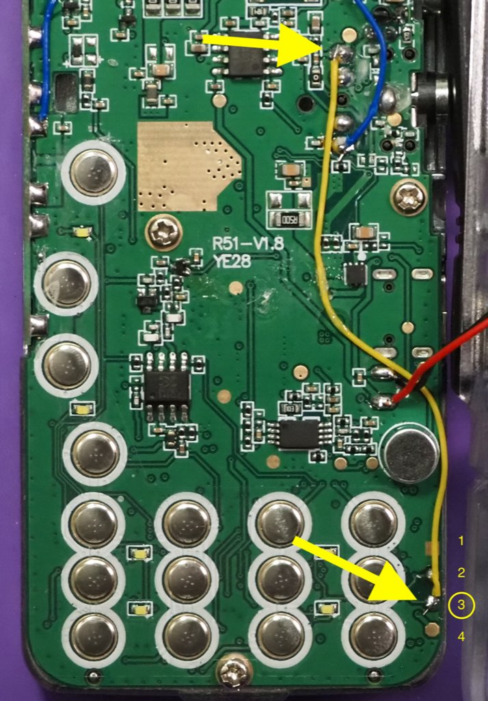

# Paddle Rework for UV-K5 v1 Original

This page is the rework guide for the original UV-K5 hardware.

--8<-- "hardware/rework-uv-k5-v3.md:k5-common-before-you-begin"

--8<-- "hardware/rework-uv-k5-v3.md:k5-common-testing-after-rework"

--8<-- "hardware/rework-uv-k5-v3.md:k5-common-rework-steps"

### Image: remove these resistors

### Image: wire 1

### Image: wire 2 - completed rework

## Next

- [UV-K5 v3 rework guide](rework-uv-k5-v3.md)
- [UV-K1 rework guide](rework-uv-k1.md)
