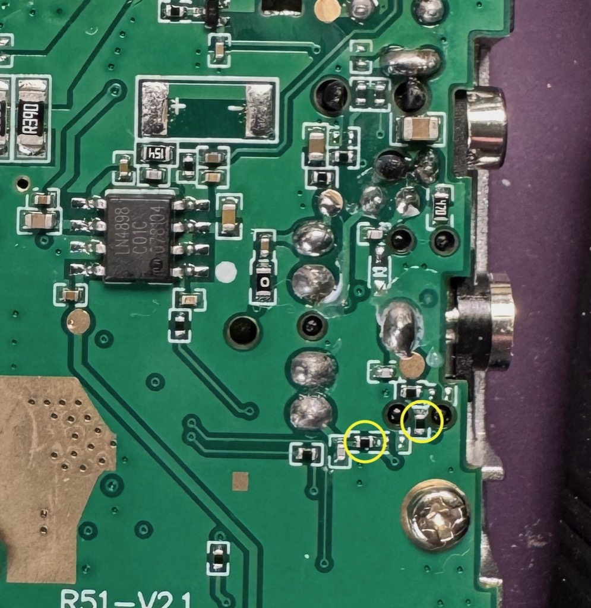
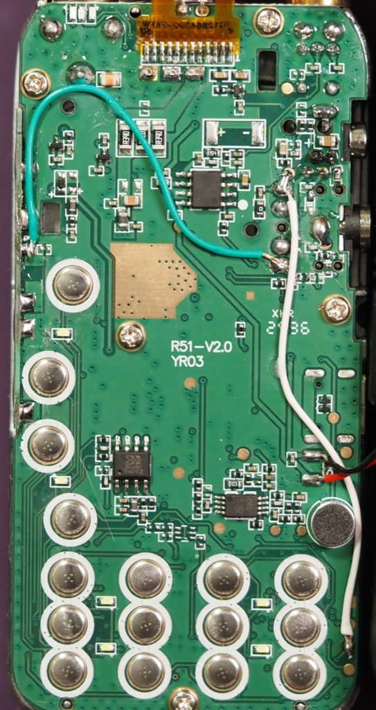

# Paddle Rework for UV-K5 v3

This page covers the UV-K5 v3 version of the CW paddle rework.

## Model notes

- The board inside the radio is labeled V2.0
- The resistors which need to be removed are nearly identical to the v1 model
- The wire locations are identical to the v1

--8<-- [start:k5-common-before-you-begin]
## Before you begin

If the radio already has the older straight-key mod, remove that wire before starting the new work. The resistor that was removed for the straight key mod is one of those that also needs to be removed for the paddle mod.
--8<-- [end:k5-common-before-you-begin]

--8<-- [start:k5-common-rework-steps]
## Rework steps

### Opening the Radio
1. Remove the battery, volume knob, and antenna. You do **not** need to unscrew the ring nuts holding down the antenna connector or the volume knob.
2. At the back lower edge of the radio, insert a thin flathead screwdriver or other prying tool in between the metal inner frame and the plastic outer one, and pry up. Do this with the front of the radio facing down, so the rubber keypad stays in the plastic case, otherwise it may catch on the display. The inner frame pivots up until you can pull it "down" to slide the upper half (with the volume and antenna knobs) completely out of the outer case.
3. Pivot the chassis open; note the speaker wires and do not strain them as you set the top half aside.
4. Using your fingers or a non-metallic prying device, press in and upward on the lower left corner of the plastic frame around the display to release the lower left tab that goes through the PCB. Once released, this corner will lift up away from the PCB. Slightly wiggling the display frame should release the upper right tab catch as well, and the display with frame can be gently hinged up and over the top of the PCB.

### Reworking the Radio

1. Remove the two reworks as noted in the picture. A hot soldering iron may be applied to each end of the resistor in turn until it loosens, or a soldering iron with a wide surface can apply across the length of a resistor to loosen and remove it all at once. Adding a small blob of solder to the end of the iron helps transfer heat to the resistor and makes removal easier.
2. Install the new wiring at the board locations shown in the photos:
    - Wire 1 connects between the left edge third down solder blob to the center-right fourth down solder blob from the headset port.
    - Wire 2 connects from the topmost of the 4 headset port solder blobs, down to the third gold pad along the bottom right edge of the board.
    - Ensure that wire 2 is routed to the right of the button pads so that it doesn't interfere with pressing buttons.

--8<-- [end:k5-common-rework-steps]

#### Image: resistors to remove

#### Image: wires to add

## Next

- [UV-K5 v1 original rework guide](rework-uv-k5-v1.md)
- [UV-K1 rework guide](rework-uv-k1.md)
