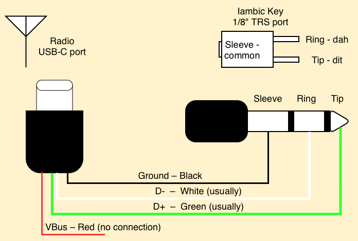

# USB-C to TRS Paddle Cable (UV-K5 v3 / UV-K1)

The UV-K5 v3 and UV-K1 both have a USB-C port that is connected to the microcontroller (the USB-C port in the K5 v1 is for charging only). The CW firmware can read a
paddle directly off that port's `DP`/`DM` data lines as plain GPIO inputs —
it does not speak USB protocol to do this, it just reads the raw line
state. A cable that wires a standard TRS paddle plug straight to the
USB-C connector's data pins lets you use any off-the-shelf iambic paddle
without opening the radio.

This is the v3/K1 equivalent of the [CEC cable](cec-cable.md) trick used on
the original UV-K5 — a no-rework way to plug in a paddle — but since v3/K1
expose real digital lines on USB-C instead of a single ADC line, the wiring
is direct, with no resistors or calibration involved.

!!! important
    This cable is **not** a "USB-C audio adapter" or any other USB-C to 1/8" TRS adapter device that you might find on Amazon today. It's a passive cable with no electronics, and it doesn't match any standard cable that device manufacturers currently make. You will have to custom build this cable.

## How it works

- **DP** (USB D+) — wire to the paddle's TRS **Tip** (dit contact). This wire is _usually_ green inside most USB cables.
- **DM** (USB D−) — wire to the paddle's TRS **Ring** (dah contact). This wire is _usually_ white inside most USB cables.
- **USB ground** — wire to the paddle's TRS **Sleeve** (common/ground).

Select one of the `USB Port` options under
[`CWkin`](../menus-and-settings.md#cw-key-input-cwkin) to enable reading
the paddle this way — see that page for the available USB Port input
modes (USB Port Iambic, USB Port Iambic Reversed, Handkey). If D+/D- got swapped because of non-standard coloring, just pick the Reversed mode as needed.

!!! note
    The built-in USB functionality (serial port, etc) will not function while the radio is in CW mode with a USB Port input mode. It will return to functioning when the mode is switched away from USB, or away from a USB Port mode.

    The headset port serial will continue to work.

## Wiring Diagram

## RFI Issues

Testing has revealed that while this input mechanism works, it's extremely vulnerable to self-RFI from the radio transmitting. The symptoms are perpetually transmitting after hitting a key, or an occasional glitch of the other key sending than the one you're hitting.

The USB port input mode is extremely sensitive to RFI because of the electrical design of the USB port's ground line on the radio. Efforts have been made to improve the results, but there are likely still situations where RFI can get in and cause a hard keydown or constant keying. If you experience a hard keydown, hold the EXIT key to stop sending.

Best practices to avoid RFI lockup:

- Keep your key cable short and shielded
- Use only as much power as you need; Medium is much less likely to cause problems than High power.
- Use a balanced radiating antenna, or move the antenna away from the radio with coax. An operator reported they had success by adding a 'rat tail' counterpoise to their antenna.
- A drastic option: connect a wire from the paddle ground (or USB port shield/ground) to the real radio ground, such as the antenna shield or the negative terminal on the back of the battery. The USB ground is *not* the same as the radio ground, and this is some of the reason for the issue.

Ongoing work will be put into trying to improve this further, which may include different wiring techniques or settings in the future.

## Next

- [Menus and settings — CW Key Input](../menus-and-settings.md#cw-key-input-cwkin)
- [CW paddle input overview](cw-paddle-input.md)
- [Paddle rework overview](rework-overview.md)
